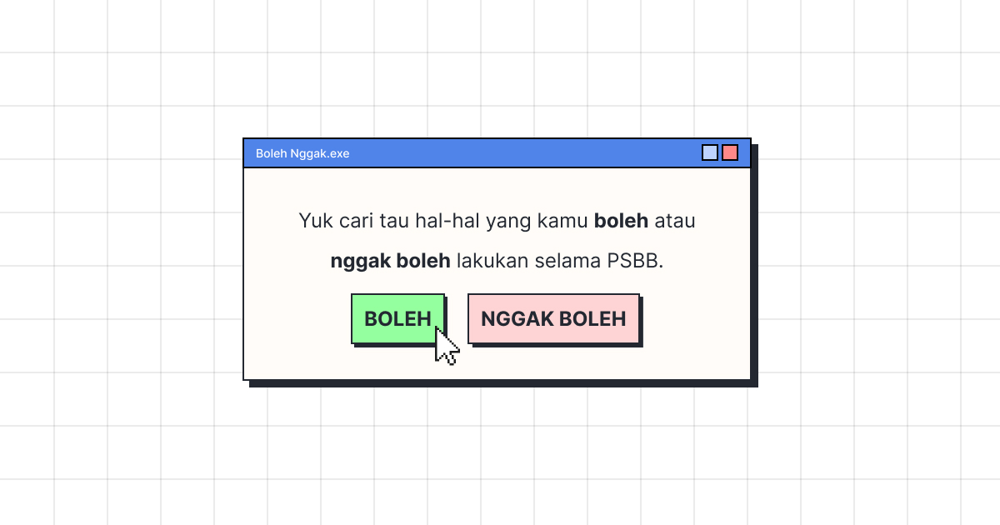

# BolehNggak.id

> **Note: This repository is archived**
>
> - The project is no longer maintained, and the domain has expired.
> - The tech stack is significantly outdated, making it difficult even for the maintainer to run in a development environment due to outdated package dependencies (e.g., Google Sheets API updates breaking the build).
> - However, you can still view a demo of the site through [https://bolehnggak-id.netlify.app](https://bolehnggak-id.netlify.app).
> - It was a fun project, and we're grateful for the enthusiasm shown by fellow Indonesian users.

  

## Project Overview

[BolehNggak.id](https://bolehnggak-id.netlify.app) is an informational website that provides guidance on activities that are permitted or prohibited for Indonesian residents during the COVID-19 pandemic, specifically during the implementation of Large-Scale Social Restrictions (PSBB).

## Inspiration

This project was inspired by [canigo.sg](https://canigo.sg). We obtained permission from the developers to build an Indonesian localized version of the concept.

## Technology Stack

- Frontend: Built with Gatsby
- Data Source: Google Sheets, fetched using `gatsby-source-google-sheets`
- Data Management: Crowdsourced via [this Google Sheet](https://docs.google.com/spreadsheets/d/16skDPETqaL8RXGsfhDtWsNLLtOabbE76Tfw_IzmR0Bg/edit?usp=sharing). Users could add comments, which our main contributors would review, add to the sheet, and provide judgments on whether the specified actions were allowed.

## Long-Term Vision

Our long-term vision for BolehNggak.id was to become the single source of truth for people seeking information about COVID-19 related dos and don'ts, not just during PSBB periods. We aimed to provide expert-sourced recommendations and guidelines to help Indonesian residents navigate the pandemic safely.

## Problem Statement

BolehNggak.id addressed two main issues:

1. **Lack of Accessible Information**: Many people found it difficult to access clear information about prohibited activities during PSBB periods.

2. **Information Overload**: Current sources of PSBB information, such as legal documents and infographics, could be overwhelming. People typically only sought this information when planning specific activities, making it challenging to find relevant details quickly.

These issues could lead to ineffective implementation of PSBB measures, as many people might unknowingly continue activities that didn't align with the goals of reducing COVID-19 transmission.

## Features

- Clear, concise information on permitted and prohibited activities during PSBB
- User-friendly interface for easy navigation
- Regular updates based on the latest government regulations and expert recommendations

## Getting Started

To view the archived version of the website, visit [https://bolehnggak-id.netlify.app](https://bolehnggak-id.netlify.app)

## Further Reading

For more insights into the project and its impact:

- [What I Learned from BolehNggak.id](https://www.linkedin.com/pulse/what-i-learned-from-bolehnggakid-interactive-center-social-gustika/) - An article detailing the learnings from this project
- [Featured on XDS Lab](https://www.instagram.com/p/B_2IrTQlw8m/?img_index=1) - XDSLabs featured this project on their Instagram

## License

This project is licensed under the [MIT License](LICENSE.md).

## Contact

For any historical questions about this project, please open an issue in this repository or contact us at [arian.raptor@gmail.com](mailto:arian.raptor@gmail.com).

---

While this project is no longer active, we hope it serves as an inspiration for future initiatives aimed at keeping communities informed and safe during challenging times.

---

# BolehNggak.id

> **注意: このリポジトリはアーカイブされています**
>
> - このプロジェクトはもはやメンテナンスされておらず、ドメインの有効期限が切れています。
> - 技術スタックが大幅に古くなっており、古いパッケージの依存関係（例：Google Sheets API の更新によるビルドの破壊）により、開発環境で実行することが困難になっています。
> - ただし、[https://bolehnggak-id.netlify.app](https://bolehnggak-id.netlify.app)を通じてサイトのデモを見ることができます。
> - これは楽しいプロジェクトでした。インドネシアのユーザーの皆様の熱心な参加に感謝いたします。

  

## プロジェクト概要

[BolehNggak.id](https://bolehnggak-id.netlify.app)は、COVID-19 パンデミック中、特に大規模社会制限（PSBB）の実施期間中のインドネシアの居住者に対して、許可または禁止されている活動に関するガイダンスを提供する情報サイトです。

## インスピレーション

このプロジェクトは[canigo.sg](https://canigo.sg)からインスピレーションを得ています。開発者から許可を得て、インドネシア向けにローカライズしたバージョンを構築しました。

## 技術スタック

- フロントエンド: Gatsby で構築
- データソース: Google Sheets、`gatsby-source-google-sheets`を使用してフェッチ
- データ管理: [この Google シート](https://docs.google.com/spreadsheets/d/16skDPETqaL8RXGsfhDtWsNLLtOabbE76Tfw_IzmR0Bg/edit?usp=sharing)を通じてクラウドソーシング。ユーザーはコメントを追加でき、主要な貢献者がレビューし、シートに追加し、特定の行動が許可されているかどうかの判断を提供しました。

## 長期的なビジョン

BolehNggak.id の長期的なビジョンは、PSBB 期間中だけでなく、COVID-19 関連の Do's and Don'ts に関する情報を求める人々にとって、信頼できる唯一の情報源となることでした。専門家の推奨事項やガイドラインを提供し、インドネシアの居住者がパンデミックを安全に乗り越えられるよう支援することを目指しました。

## 問題提起

BolehNggak.id は主に 2 つの問題に対処しました：

1. **アクセス可能な情報の不足**: 多くの人々が、PSBB 期間中の禁止されている活動に関する明確な情報にアクセスすることが困難でした。

2. **情報過多**: PSBB に関する現在の情報源（法的文書やインフォグラフィックなど）は圧倒的な量になる可能性がありました。人々は通常、特定の活動を計画する際にのみこの情報を求めるため、関連する詳細を素早く見つけることが困難でした。

これらの問題により、多くの人々が COVID-19 の感染拡大を抑制する目的に合致しない活動を知らずに続けてしまい、PSBB 措置の効果的な実施が妨げられる可能性がありました。

## 機能

- PSBB 中の許可および禁止されている活動に関する明確で簡潔な情報
- 簡単にナビゲートできるユーザーフレンドリーなインターフェース
- 最新の政府規制と専門家の推奨事項に基づく定期的な更新

## 始め方

アーカイブされたウェブサイトのバージョンを表示するには、[https://bolehnggak-id.netlify.app](https://bolehnggak-id.netlify.app)にアクセスしてください。

## さらなる読み物

プロジェクトとその影響に関する詳細な洞察については：

- [What I Learned from BolehNggak.id](https://www.linkedin.com/pulse/what-i-learned-from-bolehnggakid-interactive-center-social-gustika/) - このプロジェクトから得られた学びについての記事
- [Featured on XDS Lab](https://www.instagram.com/p/B_2IrTQlw8m/?img_index=1) - XDS Lab が Instagram でこのプロジェクトを紹介しました

## ライセンス

このプロジェクトは[MIT ライセンス](LICENSE.md)の下でライセンスされています。

## お問い合わせ

このプロジェクトに関する歴史的な質問がある場合は、このリポジトリで issue を開くか、[arian.raptor@gmail.com](mailto:arian.raptor@gmail.com)までお問い合わせください。

---

このプロジェクトはもはやアクティブではありませんが、困難な時期にコミュニティを情報に通じ、安全に保つための将来のイニシアチブの刺激となることを願っています。
